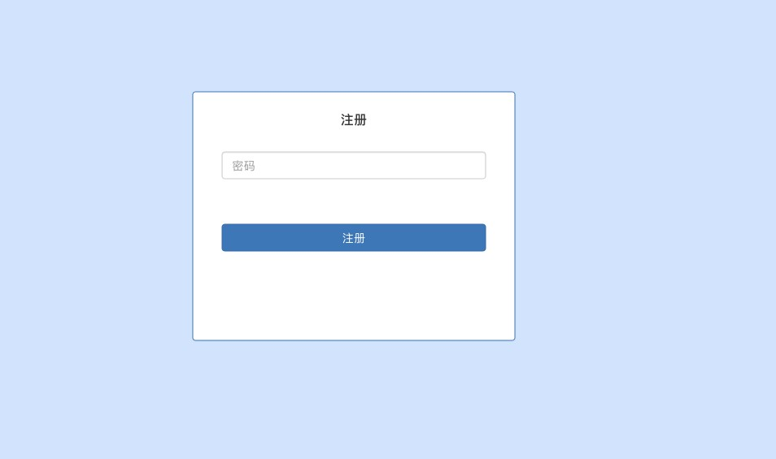
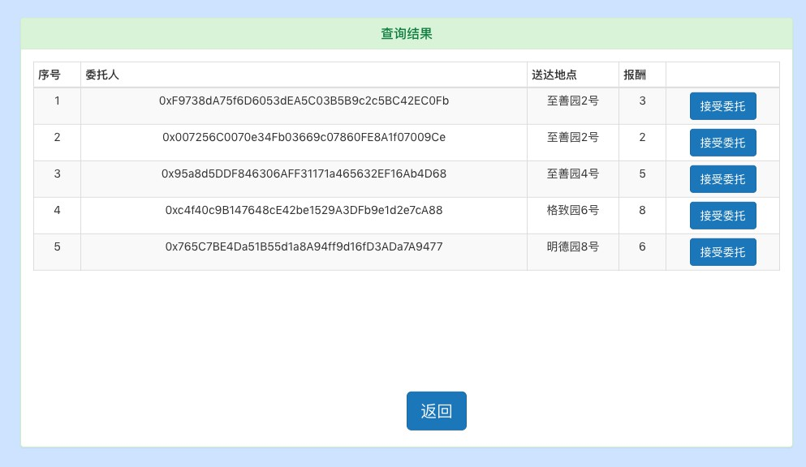
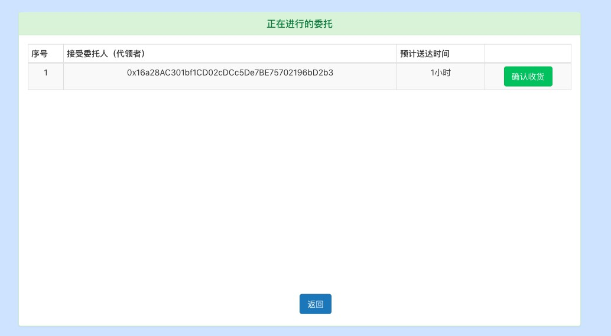

# 基于区块链的快递代领互助平台

项目仓库：https://github.com/hansenbeast/blockchain-final-project

Enviroment

```bash
OS: MacOS 10.14.2
node : v11.5.0
npm : 6.4.1
ganache : 1.2.2.24
Truffle : v5.0.0 (core: 5.0.0)
Solidity : v0.5.0 (solc-js)
```

Usage

```bash
git clone https://github.com/hansenbeast/blockchain-final-project
运行ganache（在本地7545端口）
cd blockchain-final-project
truffle migrate --reset
cd client
将ganache部署得到的合约地址复制到src\App.js第66行的contractAddr
npm run start （默认在本地3000端口）
```

## 选题背景

### 背景

根据传统第三⽅支付的痛点进行分析，了解到智能合约中关于远程购买例子的优势点所在，由于快递跑腿的需求⽐较大，为了完成最后⼀公里的配送，区块链是一个适合的委托信息发布平台，减少了中⼼化数据库维护的成本和⻛险性，且利⽤智能合约可以解决需求者和委托人之间的信任问题，保证每笔交易的公正和透明，通过一定的奖励和惩罚机制让更多同学受益。

### 优势

- P2P网络和共识机制：减少中心化运营成本，平台公正透明，智能合约自动化提高管理效率。
- 不可篡改特性：防止钓鱼用户投机，将发布的信息篡改。
- 匿名性：对用户相对的隐私保护

[具体合约设计](https://github.com/hansenbeast/blockchain-final-project/blob/master/%E5%90%88%E7%BA%A6%E9%83%A8%E7%BD%B2%E6%8A%A5%E5%91%8A.md)

## 成果展示

[演示视频传送](https://pan.baidu.com/s/1dXu7zAk8bRQSRnywDDzU2A)








## 设计说明

### 总体架构

- [智能合约](https://github.com/hansenbeast/blockchain-final-project/blob/master/contracts/Project.sol)

  使用 solidity 语言，主要负责委托信息的状态存储，双方转账的交易。

- 以太坊客户端

  使用ganache客户端，后期测试完成后可移植到geth进行多节点的运行。它会对用户提供的以太坊钱包地址、密钥对进行检查实现身份认证。用户发出的所有交易都由该账户发起，并由该账户提供发起交易所需的以太币。

- [UI界面](https://github.com/hansenbeast/blockchain-final-project/tree/master/client/src)

  使用 Web3 实现用户界面和以太坊客户端的交互，使用react框架实现不同组件之间的模块化，使用bootstrap进行美化。

### 部署环境（具体环境见开头）

启动区块链后台ganache（一个运行在内存中的区块链客户端，可以对发起的交易立即执行并自动打包到区块中，每次重启Ganache会清除之前的区块信息，但可⽤用于测试，减少了每次使⽤用geth console查看账户余额，区块信息，交易易信息的命令输⼊，[具体功能和设置](https://truffleframework.com/ganache)）

默认10个账户，余额为100 eth，networkid 为 5777，在本地7545端口运行。


注意truffle.js中network的配置和之前端口的一致性，用于接下来的migrate。

```js
const path = require("path");

module.exports = {
  // See <http://truffleframework.com/docs/advanced/configuration>
  // to customize your Truffle configuration!
  contracts_build_directory: path.join(__dirname, "client/src/contracts")
};

module.exports = {
  // See <http://truffleframework.com/docs/advanced/configuration>
  // to customize your Truffle configuration!
  networks: {
    development: {
        host: "127.0.0.1",
        port: 7545,
        network_id: "*" // 匹配任何network id
     }
  }
  
};
```

### 部署合约

`truffle migrate --reset`

根据设定的端口号找到相应的主链网络5777并默认使用第一个账户部署合约。


最终第一个账户由于部署合约消耗了一定的手续费，并得到返回的合约地址用于接下来的调用。


本次后端使用[Web3库](https://web3js.readthedocs.io/en/1.0/)与本地以太坊的私链进行交互，且根据Truffle中的[react-box](https://truffleframework.com/boxes/react)框架和[react-bootstrap](https://react-bootstrap.github.io/getting-started/introduction)进行UI设计。


首先创建一个web3的实例，设置一个`provider`。为保证不会覆盖一个已有的`provider`，比如使用Mist时有内置，需要先检查是否`web3`实例已存在。

```js
if (typeof this.web3 != 'undefined') {
	this.web3Provider = Web3.currentProvider
} else {
	this.web3Provider = new Web3.providers.HttpProvider('http://127.0.0.1:7545')
}
```

成功引入后，现在就可以使用`web3`的相关[API](https://github.com/ethereum/wiki/wiki/web3js-api-reference)了。（类似于geth中的一些用户，交易，区块操作接口）


关于部署合约方法的讨论：

本次直接使用truffle migrate自动部署，未使用geth后台手动进行挖矿等操作，使用geth的好处是可以保存之前的用户状态和交易信息，并且使用多个data文件夹可以同步多节点，达到分布式区块链的特点，但不利于合约的测试和迭代更新，其办法是：

- 直接根据合约编译后的abi和字节码（remix中可以得到）得到合约对象，[详见](http://web3.tryblockchain.org/Web3.js-api-refrence.html#toc_51)

```js
var myContract = web3.eth.contract({合约abi}); 
var my = myContract.new( { 
    from: web3.eth.accounts[0], 
    data: '{合约ByteCode}', 
    gas: '4700000' 
}, function (e, contract){ 
    console.log(e, contract); 
    if (typeof contract.address !== 'undefined' || contract != null) { 
        console.log('Contract mined! address: ' + contract.address + ' transactionHash: ' + contract.transactionHash); 
    } 
})
```

然后在geth中使用`miner.start()`，	当合约deploy时，即执行了上述js，会进行挖矿并打包

此时`my.address`为合约地址。


### 调用合约

在得到合约的地址后，便可以进行实例化为之后的合约调用作准备。本次使用的是Truffle封装好的接口TruffleContract。注意需要将合约地址赋值给contractAddr。

```js
this.Contract = TruffleContract(ProjectContract)
this.Contract.setProvider(this.web3Provider)
var contractAddr = "0x895e850A56ddb080dd1b5eE2ed2A2604f34e2Fcf";
this.Contract.at(contractAddr).then((instance) => {
    console.log(instance)
    this.contractInstance=instance
    this.setState({loading:false})
})
} catch (error) {
    // Catch any errors for any of the above operations.
    alert(
        `Failed to load web3, accounts, or contract. Check console for details.`,
    );
    console.error(error);
}
```

如果没有使用给定的接口，则通过`var myContractInstance = MyContract.at(contractAddr)`进行实例化，并且有以下几种调用合约中函数的方法

```text
// Automatically determines the use of call or sendTransaction based on the method type
myContractInstance.myMethod(param1 [, param2, ...] [, transactionObject] [, defaultBlock] [, callback]);

// Explicitly calling this method
myContractInstance.myMethod.call(param1 [, param2, ...] [, transactionObject] [, defaultBlock] [, callback]);

// Explicitly sending a transaction to this method
myContractInstance.myMethod.sendTransaction(param1 [, param2, ...] [, transactionObject] [, callback]);

// Get the call data, so you can call the contract through some other means
var myCallData = myContractInstance.myMethod.getData(param1 [, param2, ...]);
// myCallData = '0x45ff3ff6000000000004545345345345..'
```

​	值的注意的是返回值：	`String`

- 如果发起的是一个`call`，对应的是返回结果。
- 如果是`transaction`，则要么是一个创建的合约地址，或者是一个`transaction`的哈希值。即`web3.eth.sendTransaction`的返回值。	


​	基于以上的情况，修改了部分合约，增加了一些view的函数，负责提供状态变量的获取。使用call方法调用，不消耗gas。当然这个接口不能给一般的账户进行查看，需要合约账户才有权限。

​	其中一些基本调用	


接下来就是使用react进行组件化的设计，创建好拥有各自状态的组件，将应用状态和DOM拆分开来，再由组件构成更加复杂的界面。使用 `render()` 方法， 接收数据作为输入，输出页面中对应展示的内容。 然后结合bootstrap进行UI的美化。

在Content.js中根据App.js中父组件传入的state，返回不同的页面，如注册登录界面，主菜单界面和交易界面等。

​	


## 使用和测试

完成上述部署后，启动服务器

`cd client`

`npm run start`


初始用户状态


### 注册和登录

首先使用ganache中第一个账户登录，因为他没有密码，所以任意输入即可登录。


使用密码 123456 注册新账户，随机得到钱包地址。


​	

使用错误密码登录新注册的用户得到提示信息。


使用正确密码登录成功进入主菜单。

​	


### 发布委托

使用ganache中第一个账户进入主菜单后，选择发起委托


输入信息如下，取件码为123456，注意账户余额必须大于输入的报酬（至少为1，单位：ether），否则将提示无法发起委托。


当报酬大于余额时，会提示余额不足，无法发起委托。


### 查看委托

返回主菜单，选择“查看委托”，可以根据收货地点查看已发布但未接受的委托信息。


当前查询结果，用户可选择是否接受委托，注意接受者不能为发起者自己


刚才这笔交易是发起者向合约中的转账


因为当前账户为发起者自己，所以会接受委托失败


### 接受委托

选择ganache中的第二个账户登录并接受委托。

注意需要至少有5 ether的押金支付才能接受委托，以防物品损坏或者丢失的赔偿。所以余额和之前一样需要保证。

接受成功后显示订单详情，版本1暂时未加入倒计时的功能。


### 查看已被接受的委托

返回第一个账户的窗口并在主菜单选择“被接受的委托”，得到订单结果，包括接受者的钱包地址等信息




### 确认收货

当收到货确认无误时，点击“确认收货”完成交易。


此时再次查看被接受的委托，发现暂无信息。


当然选择“查看委托”同样搜索“丰巢”也会查询不到任何结果。


查看当前账户余额，发现发起者支付了3 ether 给接受者


接收者选择"收到转账"完成交易，更新此笔交易的状态。


## 不足之处

- 用户发布委托时会将重要的隐私信息，如取件码发布到区块链上，后期应该使用加密技术，将加密后的数据存放在区块链上
- 由于区块链缺少第三方的监管，在出现争议时，需要一定的逻辑判断双方的状态进行追责。
- 倒计时的设计还需完善，如果未在规定时间内完成配送，则发起者有权追责。
- 由于许多用户没有以太坊钱包地址，在新注册后由于余额不足无法支付押金和报酬，需要一定的初始量激励用户使用


