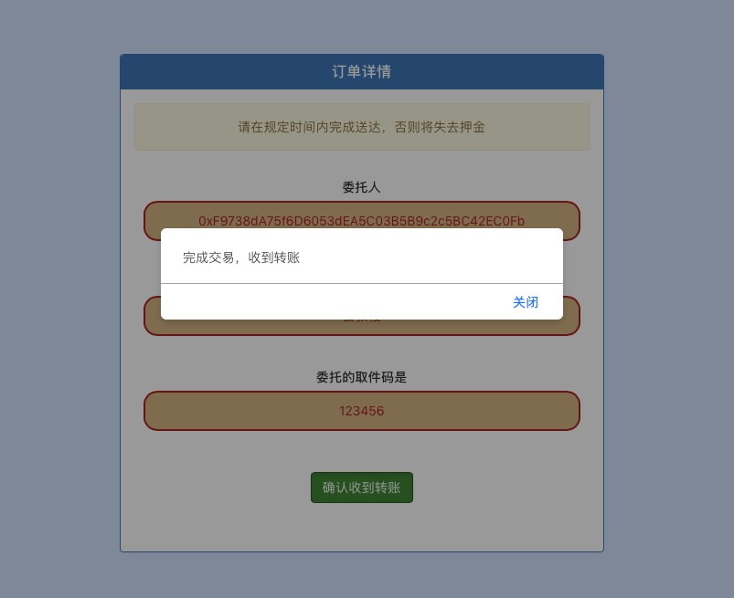

# 基于区块链的快递代领互助平台

Enviroment

```bash
OS: MacOS 10.14.2
node : v11.5.0
npm : 6.4.1
ganache : 1.2.2.24
Truffle : v5.0.0 (core: 5.0.0)
Solidity : v0.5.0 (solc-js)
```

Usage

```bash
git clone https://github.com/hansenbeast/blockchain-final-project
运行ganache（在本地7545端口）
cd blockchain-final-project
truffle migrate --reset
cd client
将ganache部署得到的合约地址复制到src\App.js第66行的contractAddr
npm run start
```

## 选题背景


## 成果展示





