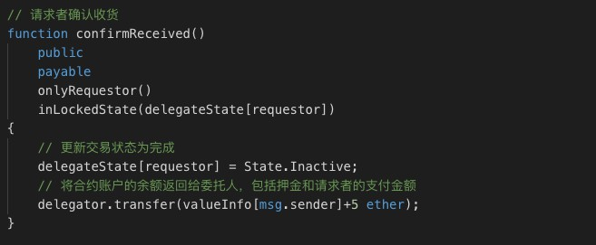
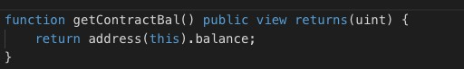
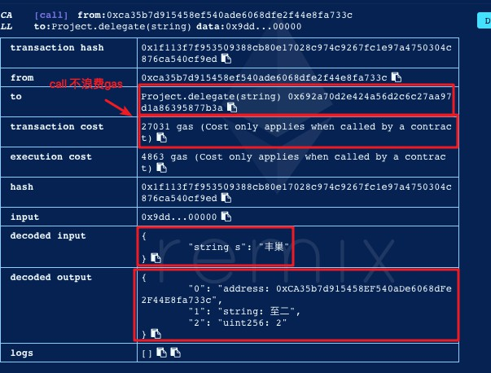
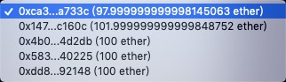
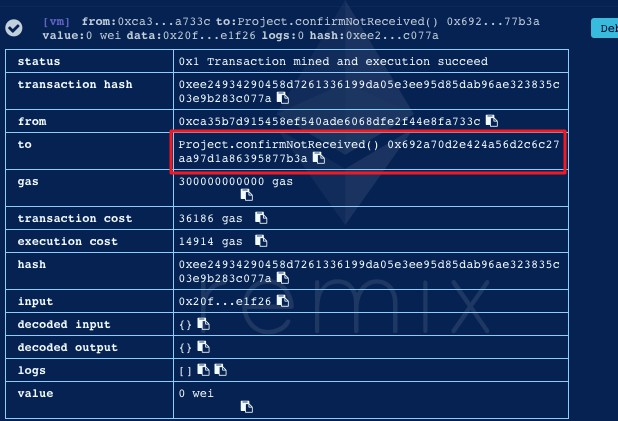

# 合约部署报告

> 提交合约部署报告，报告里应包含合约部署在链上的截图，接口的设计，调用的情况以及返回的结果等，是同学们对合约开发部署情况的验收【注意：如改了题目应把新的题目附在这一期的报告里】
>

## Solidity学习

### 1、函数修改器（ Function Modifiers）

函数修改器与Python 中的装饰器类似， 可以在一定程度上改变函数的行为， 比如可以在函数执行前自动检查参数是否合法。 函数修改器可以被继承， 也可以被派生类覆盖重写。 

### 2、view 函数

在声明一个函数时， 可以使用view 关键字告诉编译器这个函数进行的是只读操作，不会造成其他状态变化。

### 3、mapping类型

[映射](https://solidity-cn.readthedocs.io/zh/develop/types.html#index-20)是一种引用类型，存储键值对，提供根据键查找值，与其它语言中的字典，`map`等类似，但也有非常大的不同，尤其它在区块链中独特的存储模型。映射只能声明为storage的状态变量，或被赋值给一个storage的对象引用。

实际存储时是以哈希键值对的方式。其中哈希是由键值和映射的存储槽位序号拼接后计算的哈希值（映射只占一个槽位序号），也就是说值是存到由`keccak256(k . p)`计算的哈希串里，这里的`k`表示的是映射要查找的键，`p`表示映射在整个合约中相对序号位置。

## 合约内容

### 1、设计与构思

**题目：在以太坊上实现快递跑腿代收的业务**

根据传统第三方支付的痛点进行分析，并了解到智能合约中关于远程购买例子的优势点所在，由于快递跑腿的需求比较大，为了完成最后一公里的配送，区块链是一个适合的委托信息发布平台，减少了中心化数据库维护的成本和风险性，且利用智能合约可以解决需求者和委托人之间的信任问题，保证每笔交易的公正和透明，通过一定的奖励和惩罚机制让更多同学受益。

**启发与构思：**

传统支付宝在交易中起到信用中介的作用，避免用户钱货两空。虽然支付宝主要是保护了用户方的利益，但是支付宝会从商家店铺收取租金，羊毛出在羊身上，商家再将这笔费用隐形的转给用户。

合约代码逻辑采用的形式不同于支付宝的逻辑，**合约多了押金**，在远程购买的例子中押金和实物的价钱相等，买卖的流程也不一样，方向倒置，达到了和支付宝买卖担保一样的功能。具体流程如下：

A. 由商铺发起合约，将押金和商品的价钱打到合约账户，表示要卖东西了。

- 如果商铺在缴钱之后，不想卖了，这个时候只要用户没有缴钱，商铺是可以主动取消交易的，这个时候合约账户的余额会全部返还给商铺。

B. 用户表示对商品感兴趣，于是也交纳等量的押金和商品的价钱到合约账户。

- 在用户缴纳押金和价钱后，合约账户余额为4倍价钱。

C. 商铺在线下将商品发送给用户。

- 一旦用户缴钱了，商铺就不可以反悔，否则就会损失押金的费用。

D. 用户收到商品后确认，押金自动返还给用户，合约账户的余额自动返回给商铺。

- 返还押金给用户后，账户余额还剩3倍价钱，这部分余额包含商铺缴纳的押金和价钱，还有用户缴纳的价钱，一起打给商铺。于是交易成功完成。

**具体设计：**

1. 用户分为发布委托者，即请求者和委托人，其中请求者可以将委托信息发布到区块链中，委托信息包括快递起始地点，如丰巢，终点，如宿舍，和取件码，其中取件码受到权限保护，一起保存在合约中，前提是要至少要交1个以太币的跑腿费用。
2. 由于在版本1.0中缺少用户管理的功能，委托人只能根据希望代收的快递地点进行查询，如输入“丰巢”，然后返回位于丰巢的委托信息（注意包括送货地点信息，发起委托者的地址和发起者愿意支付的以太币）不包括取件码信息。
3. 委托人可以根据委托信息选择是否接受委托，并通知发起者，前提是需要交5 ether的押金，然后发起者会将取件码授权访问给委托人，委托人在得到取件码后需要在规定的时间（1 小时）内完成交易，否则发起者可以确认交易失败，合约账户将委托人的押金转给发起者。
4. 当确认收货时，发起者需如实进行确认，不可抵赖，这时交易状态和委托信息进行更新，之前合约账户中的押金和发起者支付的以太币由智能合约负责一并转给委托人，交易完成。

### 2、接口设计

不包括函数修饰器

1. 状态变量

2. 发布委托

   

3. 查询委托消息

   

4. 接受委托

   

5. 收货确认

   

6. 超时未完成可以确认交易失败

   

7. 查看合约账户余额

   

### 3、部署结果

环境：

1. Solidity的开发框架Truffle：
   - 内置的智能合约编译，链接，部署和二进制文件的管理。
   - 快速开发下的自动合约测试。
   - 脚本化的，可扩展的部署与发布框架。
   - 部署到不管多少的公网或私网的网络环境管理功能
   - 使用EthPM&NPM提供的包管理，使用[ERC190](https://github.com/ethereum/EIPs/issues/190)标准。
   - 与合约直接通信的直接交互控制台（写完合约就可以命令行里验证了）。
   - 可配的构建流程，支持紧密集成。
   - 在Truffle环境里支持执行外部的脚本。
2. Ganache以太坊客户端：Ganache 是一个本地内存执行的轻量级客户端， 有良好的交互界面，它能做到对 Transaction 的立即执行， 因此使用者可以迅速地创建和调用自己编写的智能合约 ，由于每次在内存中执行，每次重启Ganache会清除之前的区块信息，但可用于测试合约，减少了每次使用geth console查看账户余额，区块信息，交易信息的命令输入。
3. remix 在线IDE部署合约并调用

使用`truffle init`初始化框架

- Build/- 编译之后生成的 Artifacts （实际上是智能合约对应的 ABI 信息）。
- contract/ - Truffle默认的合约文件存放地址。
- migrations/ - 存放发布脚本文件
- test/ - 用来测试应用和合约的测试文件
- truffle.js - Truffle的配置文件

Truffle 项目会默认包含一个名叫 Migrations 的智能合约， 这个合约可以将用户执行部署的历史记录下来。

在remix中调试完成智能合约后，修改发布脚本。

`truffle compile`后开启ganache。

ganache处于自动挖矿状态，查看测试网络的端口和networkID，初始共有10个账户，每个账户100个以太币。

修改truffle.js中的配置信息。

`truffle migrate`移植到测试网络上

合约地址

查看日志

查看所有交易信息

查看具体区块信息

### 4、调用情况

1. 使用第一个账户部署合约

   调用合约的默认构造函数，并得到合约地址

2. 使用第一个账户发布委托

​	提示发送的value值至少为1个以太币

​		

​	传入参数：

- ”丰巢“（快递地点）
- “至二”（取货地点）

- “111”（取件码）

  转入合约账户2个以太币

3. 查询委托信息

   使用第一个账户查询（delegate）委托信息，返回发起者地址，送货地点和支付的以太币

​	因为delegate接口为view类型，调用为call，不消耗gas。

4. 接受委托

   使用第一个账户调用接受委托函数，出现错误，提示委托者不能为发起者自己。

​	使用第二个账户继续调用，出现错误，提示委托者交5以太币押金。

​	设置5以太币继续调用，返回取件码信息，同时计时开始。

5. 确认收货

   使用委托人的账户发起确认收货，返回错误信息，提示只有发起者可以调用。

​	使用发起者账户确认，发现发起者的账户中2个以太币成功转入委托人的账户中。

​	再次查看“丰巢”的委托信息，发现返回默认地址，表示无相关委托信息。

​		

6. 确认未收货

   使用第一个账户发起另一笔委托信息，金额为4以太币。

   

   使用第三个账户接受委托。

   

   第一个用户发起确认未收货调用，返回未超时，不能确认。

   

   由于是测试，限时时间设为1分钟，之后再次调用。

   ​	

   第三个账户的5以太币押金转入第一个账户。

   

   更新交易状态，此时如果再次调用接受第一个账户原来的委托，返回错误状态提示。

   

